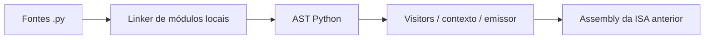

# old_compiler · compilador Python legado da my-vm

Protótipo histórico que converte **um subconjunto de Python** em Assembly para versões anteriores da my-vm. Registra a primeira abordagem de frontend com `ast`, antes da linguagem CVM e do compilador em Rust. Não participa da compilação do sistema atual.

## Como funciona



`compiler/linker.py` descobre módulos locais e ordena dependências. `compiler/compiler.py` coordena a compilação; os visitors processam expressões, funções e controle de fluxo; o contexto mantém registradores e metadados; o emissor produz instruções textuais.

O código e os testes incluem variáveis, aritmética, comparações, `and/or`, `if`, `while`, `for range`, funções, listas, strings e imports locais. `myvm_lib.py` contém símbolos reconhecidos pelo compilador, como `entry_point` e `print_str`; não implementa uma biblioteca Python executável equivalente.

## Gerar Assembly

Requer Python 3; o frontend usa a biblioteca padrão.

```bash
python3 main.py entrada.py saida.asm
```

Sem o segundo argumento, a saída recebe o mesmo nome-base do arquivo de entrada e extensão `.asm`. Exemplo de fonte:

```python
from myvm_lib import entry_point, print_str

@entry_point
def main():
    print_str("Hello, VM!")
```

A saída pode conter `WRITESTR`, ausente do parser atual de my-vm. Gerar Assembly não comprova compatibilidade com a VM atual.

## Testes e limitações

```bash
python3 -m unittest discover -s tests -v
```

Na revisão de 05/10/2026: **126 testes descobertos; 106 passaram, 2 falharam e 18 foram ignorados**. Falhas existentes: `test_emit_label` e `test_while_labels_are_unique`, relacionadas à representação textual de labels. Os testes de execução foram ignorados por falta do binário esperado.

`tests/test_runner.py` ainda procura `target/debug/my-vm` e `vm-compiler/main.py` em um layout antigo. Portanto, a suíte não valida o pipeline atual sem adaptar caminhos e ISA. O projeto não implementa Python completo e não deve ser apresentado como substituto do interpretador Python.

## Documentação

- [Arquitetura](docs/architecture.md)
- [Linguagem](docs/language.md)
- [Internos](docs/compiler_internals.md)
- [Opcodes históricos](docs/opcodes.md)
- [Exemplos](docs/examples.md)

Os documentos históricos descrevem a versão de origem. O desenvolvimento atual usa [my-vm-compiler](https://github.com/emanuelVINI01/my-vm-compiler), [my-vm](https://github.com/emanuelVINI01/my-vm) e [my-vm-os](https://github.com/emanuelVINI01/my-vm-os).

O código está no repositório privado [my-vm-legacy-compiler](https://github.com/emanuelVINI01/my-vm-legacy-compiler), que requer acesso autorizado no GitHub. Não há arquivo de licença nesta versão.
